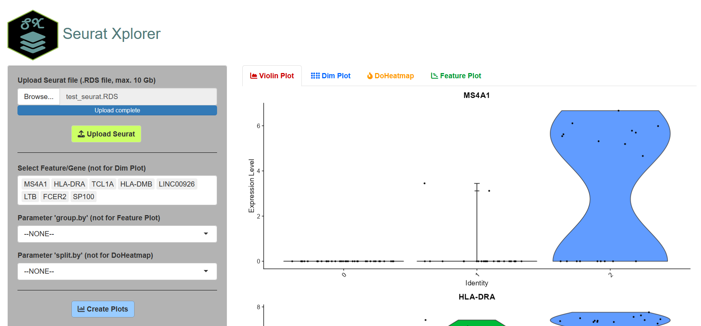

# Seurat Xplorer
Vizualize features from Seurat data

#


# User manual

[Option 1: Use Seurat Xplorer via docker](#option-1-docker)

[Option 2: Use Seurat Xplorer application implemented in FASTGenomics](#option-2-fastgenomics)
A quick way to try Seurat Xplorer. Be aware that the configureation of the server is very limited (2 vCPUs @2.1GHz, 16 GB RAM). 

[Option 3: Use Seurat Xplorer locally (Advanced users)](#option-3-local-machine)

# Option 1: Docker
1. Pull the docker image to your system
  ```
  docker pull altayyuzeir/seurat_explorer:v0.1.0
  ```
2. Start the application
  ```
  docker run --name Seurat_Xplorer -it -p 3838:3838 altayyuzeir/seurat_explorer:v0.1.0 bash
  ```
3. Once getting into the terminal, open the shiny app
  ```
  /usr/bin/run-shiny.sh shiny
  ```
4. Go to your web broswer and visit the port: http://localhost:3838/proxy/shiny
5. Do your analysis according to the steps described in option 2.
6. Ctrl+C in command terminal to close shiny app. _exit_ - command to close the application

# Option 2: FASTGenomics

Step 1: Upload data\
1.1 Go to website [https://beta.fastgenomics.org/a/seurat_xplorer](https://beta.fastgenomics.org/a/seurat_xplorer) To use the application, unfortunately you need to login with an account. You can register a your own account, but to test the application you can also use our account (Username: intestline@gmail.com Password: intestline).\
1.2 Upload Seurat .RDS file.

Step 2: Select 1 feature to visualize and the _group.by_ and/or _split.by_ parameters where applicable.

Step 3: Navigate through the different tabs for the different visualizations.

# Option 3: Local machine
1. Following libraries are needed to run the shiny app: _Suerat_, _SeuratData_, _sp_.
2. Download/clone the package from the Seurat_Xplorer repository.
3. Run the app in docker/APP/app.R
4. Following the steps described in option 2.


